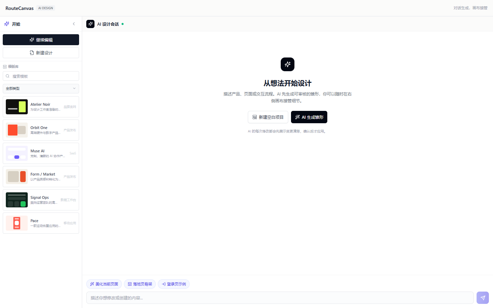
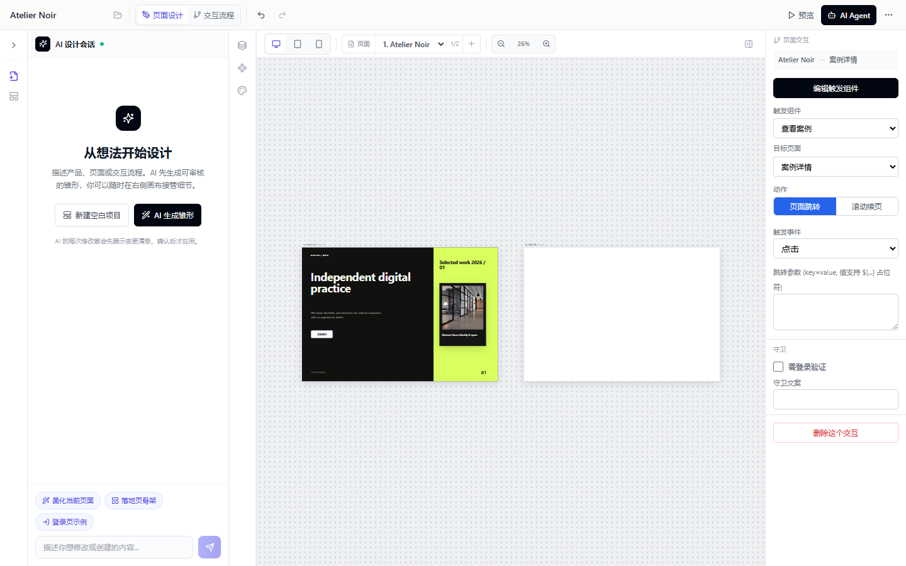
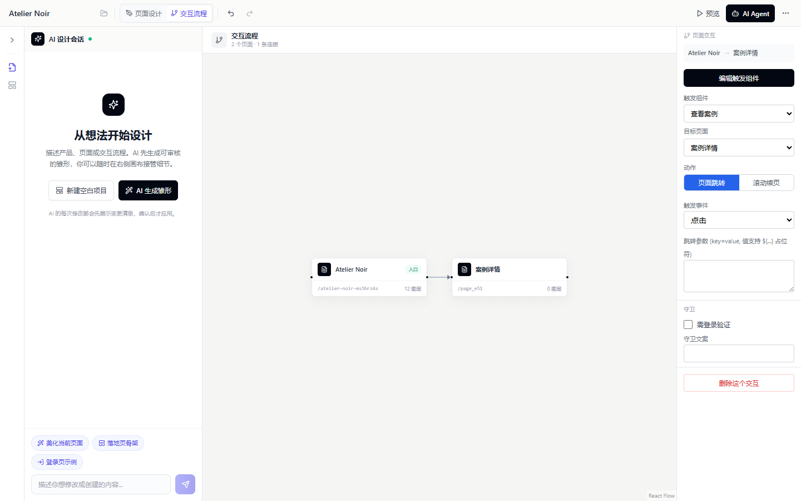

# RouteCanvas V1.1

> AI 对话生成、无限画布编辑与页面流程设计，统一在一个前端工作台中。

RouteCanvas 是一个面向产品设计与前端原型的浏览器工作台。你可以从空白项目或设计模板开始，让 AI 生成页面雏形，再在同一项目的无限画布中编辑多个页面、配置按钮跳转、检查交互流程，并导出可由 AI 或开发工具继续消费的结构化数据。



## V1.1 更新

- **AI-first 工作区**：左侧项目与模板入口、中部 AI 设计会话、右侧项目画布按需展开。
- **真正的多页面无限画布**：项目内所有页面同时可见，可自由平移、缩放和拖动画板；页面下拉框只负责定位，不会隐藏其他页面。
- **设计与流程联动**：在组件属性中设置点击目标后，交互流程会立即生成对应连接；流程视图也能继续编辑触发组件、目标页面、动作和守卫。
- **项目与模板语义清晰**：模板用于创建独立项目，不再把不相关页面混入当前画布；支持品牌官网、产品发布、SaaS、数据工作台和移动应用分类。
- **全局 AI Agent**：顶部统一配置 OpenAI 或兼容接口的 Base URL、模型和 API Key，AI 会话内不再重复出现 Key 设置。
- **更顺手的编辑体验**：组件库可完整滚动，工具栏与页面切换更紧凑，并支持文字、图片、注释、截图标记与 AI 局部修改。

## 核心工作流

RouteCanvas 的层级关系是：**工作区 → 项目 → 无限画布 → 多个页面 → 页面间交互**。

1. 从模板库创建项目，或点击“新建设计”创建空白项目。
2. 在右侧画布顶部点击 `+`，把新页面加入当前项目；新页面会自动排列在已有页面右侧。
3. 拖动画板标题调整页面位置；拖动画布空白处、按住空格或使用鼠标中键平移；滚轮平移，`Ctrl/Cmd + 滚轮` 缩放。
4. 从组件库拖入组件，在属性面板修改文字、图片、布局、样式、注释与响应式参数。
5. 选中按钮等组件，在“点击交互”中选择目标页面；切换到“交互流程”检查或修改完整页面路径。
6. 点击“预览”验证实际跳转或滚动续页效果。

## 无限画布与页面交互



上图中 `Atelier Noir` 与 `案例详情` 是同一个项目里的两个独立页面。顶部页面选择器用于快速聚焦，两个画板仍始终存在于同一空间。右侧面板正在编辑“查看案例”按钮到“案例详情”的页面跳转。



流程视图采用紧凑自动排布，将组件动作映射为页面连接。选中连接后可以修改触发组件、目标页面、跳转或滚动动作、触发事件、参数与登录守卫。

## 主要能力

| 能力 | 说明 |
| --- | --- |
| AI 设计会话 | 对话生成页面雏形、展示变更清单，并支持确认后应用 |
| 无限画布 | 多画板并排、自由平移缩放、拖动画板、自动放置新页面 |
| 页面流程 | 自动排布页面关系，配置跳转、滚动续页、参数与守卫 |
| 可视化编辑 | 拖拽组件，编辑文字、图片、样式、布局、层级和响应式参数 |
| 注释与标记 | 保存设计意图，截图标记局部区域并交给 AI 修改 |
| 模板库 | 按场景筛选高完成度模板，并从模板创建独立项目 |
| 组件生态 | 内置基础、表单、Dashboard、Shadcn、Magic UI、Aceternity、React Bits、3D 等组件 |
| 代码导入 | 解析 HTML、React TSX、Vue SFC 与 Svelte，生成可编辑节点 |
| 数据协同 | JSON 导入导出、浏览器本地存储、MCP 双向同步 |
| 实时预览 | 在预览模式中验证页面跳转与滚动交互 |

## 快速开始

### 环境要求

- Node.js 18+
- npm

### 本地运行

```bash
git clone <repo-url>
cd RouteCanvas
npm install
npm run dev
```

打开 [http://localhost:3000](http://localhost:3000)。

### 生产构建

```bash
npm run build
npm start
```

## AI Agent 配置

点击项目工具栏中“预览”旁的 **AI Agent** 按钮，统一配置：

- Base URL，例如 `https://api.openai.com/v1`
- 模型，例如 `gpt-4o-mini`
- API Key

前端填写的配置保存在当前浏览器的 `localStorage` 中，请只在可信设备上使用。部署方也可以通过环境变量预设服务端 Key：

```bash
OPENAI_API_KEY=your_api_key
```

用户在全局 AI Agent 中填写的 Key 优先于环境变量。Base URL 支持 OpenAI-compatible API。

## MCP Server

RouteCanvas 内置 MCP Server，让支持 MCP 的 AI 开发工具直接读取和修改 `canvas.json`，包括获取画布、管理页面与节点、创建连接、注册组件和导入前端代码。

```bash
cd mcp
npm install
npm run build
```

仓库已提供 `.cursor/mcp.json` 示例配置：

```json
{
  "mcpServers": {
    "routecanvas": {
      "command": "node",
      "args": ["mcp/dist/index.js"],
      "cwd": "${workspaceFolder}",
      "env": {
        "ROUTECANVAS_FILE": "${workspaceFolder}/canvas.json"
      }
    }
  }
}
```

## 技术栈

- Next.js 14、React 18、TypeScript
- Zustand、zundo
- React Flow 12
- Tailwind CSS、Framer Motion、Lucide React
- Three.js、React Three Fiber
- Model Context Protocol SDK、Zod

## 项目结构

```text
src/
├── app/          # 页面、预览与 API 路由
├── canvas/       # 编辑器、流程图与标注层
├── design/       # 多画板无限画布
├── components/   # 组件系统、模板渲染与全局对话框
├── panels/       # AI 会话、工具栏、组件库与属性面板
├── store/        # 画布和工作区状态
├── data/         # 模板、序列化与 AI 操作
├── lib/          # AI 配置、解析器、MCP 与项目管理
└── types/        # 核心 Schema

mcp/              # 独立 MCP Server
docs/images/      # README 演示截图
```

## License

MIT
