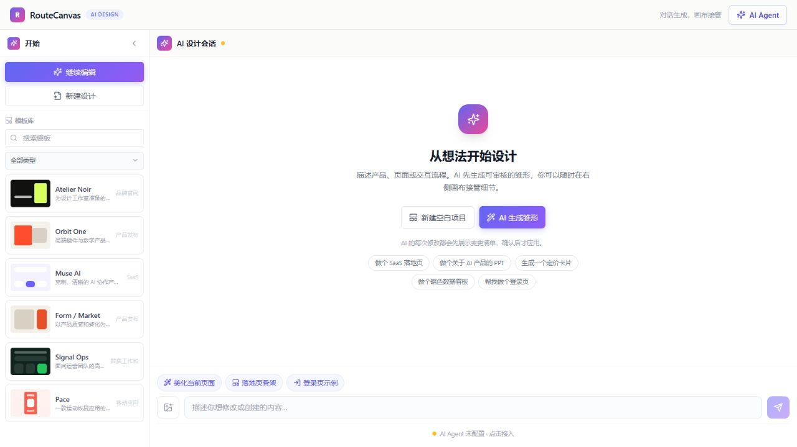
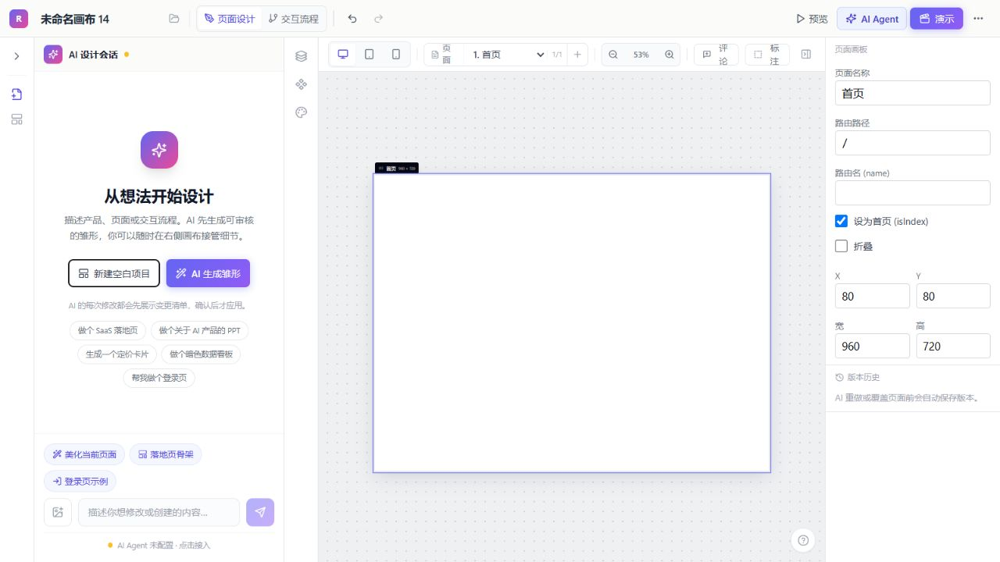
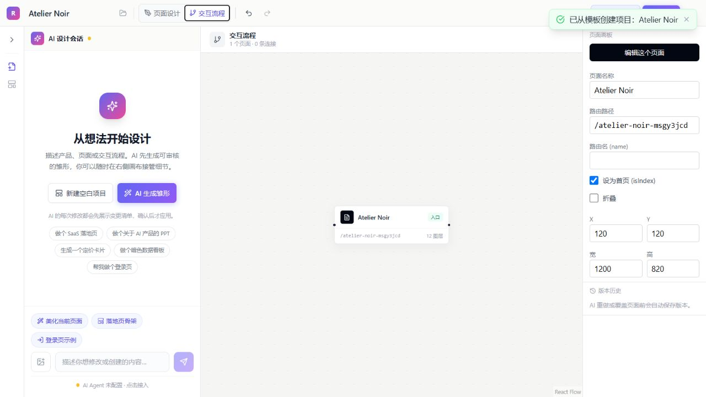

# RouteCanvas

> AI-first 前端设计工作台：从一句想法开始，在无限画布上完成页面、流程与可交付代码。

**V1.2 · Design workspace for ideas, interfaces and flows**

RouteCanvas 把 AI 对话、页面设计、原型交互和前端代码导出放进同一个项目模型。它不是“生成一张图就结束”的工具：AI 先提出可审核的变更，设计师在画布中接管细节，再用流程视图检查页面之间的真实跳转。



## 产品模型

```text
项目
 ├─ 页面 1 ─┐
 ├─ 页面 2  ├─ 页面间流程（点击、跳转、滚动、守卫）
 └─ 页面 3 ─┘
```

- 左侧是工作区、模板和组件入口。
- 中部是 AI 设计会话，负责理解意图、规划和审核变更。
- 右侧是按需展开的无限画布，负责摆放和编辑所有页面。
- 流程视图是高级检查面板，不会复制一套独立的页面数据。

## 30 秒上手

1. 点击「新建空白项目」、选择模板，或让 AI 生成雏形。
2. 在画布顶部点击「+ 页面」，新页面会留在同一块无限画布中。
3. 从组件库拖入组件，直接修改文字、图片、尺寸、布局和响应式属性。
4. 选中按钮，在右侧设置「点击后 → 前往页面 / 滚动到区域 / 无动作」。
5. 点击「预览」验证真实跳转，再切到「交互流程」检查完整路径。
6. 需要交付时导出 HTML、React、Vue、Compose、PDF、PPTX 或只读分享链接。

## 核心能力

| 工作流 | 能力 |
| --- | --- |
| AI 设计 | 对话生成页面雏形、视觉主题和组件；修改先形成提案，支持全部应用、选中应用、取消和撤销 |
| 无限画布 | 多页面同屏摆放；滚轮以鼠标为中心缩放，Shift + 滚轮平移，Space/中键拖动画布，拖动标题移动页面 |
| 页面流程 | 页面间跳转、滚动区域、事件、参数和登录守卫；空页面不能生成虚假触发节点 |
| 画布编辑 | 文字双击编辑、图片替换、节点拖拽、八向缩放、多选、对齐参考线、图层拖拽排序 |
| 标注反馈 | 点击「标注」框选区域后，在选区右下角出现自适应虚线气泡；输入修改意图后交给 AI，不弹全屏遮罩 |
| 组件生态 | 基础组件、表单、Dashboard、Shadcn、Magic UI、Aceternity、React Bits、3D 与动效组件包 |
| 模板库 | 品牌官网、产品发布、SaaS、数据工作台、移动应用；模板创建独立项目，不污染当前画布 |
| 响应式 | Desktop、Tablet、Mobile 断点；Stack/Grid 与 `parentId` 同时影响画布、预览和代码导出 |
| 版本与审核 | 页面级快照、缩略对比、AI Diff、影响范围高亮和安全撤销 |
| 交付 | JSON、PNG、PDF、PPTX、单文件 HTML、React、Vue 3 SFC、Jetpack Compose |
| 自动化 | 手动、新页面创建后、AI 修改采纳后三类触发器；动作节点、运行日志、失败停止和重试 |
| MCP | 编辑器与 `canvas.json` 双向同步，便于 AI 开发工具读取和修改项目结构 |





## 设计交互细节

RouteCanvas 把“页面移动”和“画布平移”分成两种明确操作，减少第一次使用时的误解：

| 操作 | 结果 |
| --- | --- |
| 拖动页面顶部标题栏 | 移动当前页面在无限画布中的位置 |
| 拖动画布空白处 | 平移无限画布 |
| Space + 拖动 / 鼠标中键拖动 | 平移无限画布 |
| 鼠标滚轮 | 以鼠标位置为中心连续缩放 |
| Shift + 滚轮 | 平移画布 |
| 双击文字节点 | 就地编辑文字 |
| Alt + 拖动 | 复制节点并保持对齐参考 |
| Ctrl/Cmd + D | 复制选中节点 |
| Delete / Backspace | 删除选中节点或连接 |
| Escape | 退出标注、编辑、预览或当前弹层 |

标注流程始终发生在画布内：框选区域后，虚线选区的右下角出现修改气泡；气泡会根据文字长度扩大，并在靠近画布边缘时自动收敛到可用空间。空白区域也可以直接让 AI 生成局部结构。

## 从设计到代码

画布中的交互语义会被同一份项目 Schema 消费：

1. 页面 frame 决定 Desktop、Tablet、Mobile 的尺寸和布局。
2. `parentId`、Stack、Grid 决定容器和子节点的真实层级。
3. `transitions` 描述按钮点击、页面跳转和区域滚动。
4. 预览播放器、HTML、React、Vue 和 Compose 导出共享这些语义。

这意味着导出不是把截图“贴”到代码里，而是尽量保留页面层级、响应式 frame 和可执行交互。PPTX 和 PNG/PDF 属于视觉交付，HTML/React/Vue/Compose 属于结构化交付。

## AI 修改的审核边界

AI 不会静默覆盖画布。每次生成或修改都会经过：

```text
意图 → 设计方法论 → 操作提案 → 依赖补全 → 影响范围 → 用户审核 → 事务化应用
```

- 提案显示新增页面、修改节点和建立连接的影响范围。
- 选择子操作时会自动带上前置依赖，避免生成半截页面。
- 应用失败时整批回滚，不留下半成品。
- 应用后仍可查看 Diff、恢复页面版本或撤销本次 AI 变更。

## AI Agent 配置与安全

AI Agent 是全局唯一的 AI 配置入口，位于首页顶部和项目工具栏中。聊天面板不会重复要求填写 Key。

支持：

- OpenAI API 或 OpenAI-compatible Base URL
- Model、Base URL、API Key 和连接测试
- 服务端 `OPENAI_API_KEY` 作为部署方默认 Key

### 重要的 Key 隔离规则

- 用户在浏览器填写的 Key 只保存在当前浏览器 `localStorage`，不会写入 `canvas.json`、项目快照、分享快照、导出文件、PPTX、README 或 Git。
- `.env.local`、`.env*.local` 已加入 `.gitignore`；`.env.example` 中的 Key 始终为空。
- 本地分享快照目录 `.data/` 与 MCP 画布文件 `canvas.json` 同样被 `.gitignore` 排除。
- AI 请求只在用户发起生成或修改时发送到 `/api/ai/chat`，请求结束后不会把 Key 写入画布数据。
- 不要把真实 Key 粘贴进源代码、截图、Issue、Pull Request 或示例配置。发布前请运行敏感信息扫描并检查 `git diff`。

```bash
# 部署方可选配置，真实文件应放在未提交的 .env.local
OPENAI_API_KEY=
```

Base URL 会限制为 HTTP/HTTPS；生产环境建议使用 HTTPS、设置请求超时和可信域名白名单。分享链接是只读设计快照，不是账号权限系统，也不等同于多人协作。

## 本地开发

### 环境

- Node.js 18+
- npm 9+

### 启动

```bash
git clone <repo-url>
cd RouteCanvas
npm install
npm run dev
```

打开 <http://localhost:3000>。

### 生产构建

```bash
npm run build
npm start
```

如果开发服务器长期运行后出现 Next 路由缓存错误，先停止该项目的 `next dev` 进程，再删除可再生的 `.next` 目录后重建。

## 验证命令

```bash
npx tsc --noEmit
npm run lint
npm test
cd mcp && npx tsc --noEmit
npm run build
```

当前核心测试覆盖 AI 操作依赖、transition 完整性、Stack/Grid 嵌套导出和 12 套审美方法论。浏览器回归还应覆盖：空白项目、同画布新页面、缩放/平移、标注气泡、模板创建、流程检查、预览、PPTX 下载、分享链接和自动化日志。

## MCP Server

MCP Server 位于 `mcp/`，用于让支持 MCP 的工具读取和修改项目结构。默认读写仓库根目录的 `canvas.json`；该文件是用户数据，已被 `.gitignore` 排除。

```bash
cd mcp
npm install
npm run build
```

示例配置：

```json
{
  "mcpServers": {
    "routecanvas": {
      "command": "node",
      "args": ["mcp/dist/index.js"],
      "cwd": "${workspaceFolder}",
      "env": {
        "ROUTECANVAS_FILE": "${workspaceFolder}/canvas.json"
      }
    }
  }
}
```

MCP 能力包括获取画布、管理页面和节点、创建连接、注册组件、导入前端代码，以及把外部修改自动同步回编辑器。

## 项目结构

```text
src/
├── app/          # 编辑器入口、预览页和 API 路由
├── canvas/       # 无限画布、流程视图和 Prototype 播放器
├── design/       # 页面画板、选择、缩放、标注与布局
├── components/   # 内置组件、模板渲染和动态组件包
├── panels/       # AI 会话、工具栏、组件库、属性面板
├── store/        # 画布、版本、自动化和工作区状态
├── data/         # 模板、序列化、AI 操作和审美技能
├── lib/          # AI 配置、导出、解析、分享和 MCP 同步
└── types/        # 项目 Schema

mcp/              # 独立 MCP Server
tests/            # Vitest 核心测试
docs/images/      # README 演示截图
```

## 当前边界

- PPTX 是页面高清截图式导出，保证视觉一致，但不是可逐元素编辑的 PowerPoint 文件。
- 分享快照使用部署服务器文件存储，暂未包含账号、权限和外部对象存储。
- 自动化的 AI 动作会派发到 AI 会话并等待用户审核，不是后台无人值守执行。
- 实时多人协同不在 MVP 范围内。

## License

RouteCanvas is released under the [MIT License](LICENSE).
